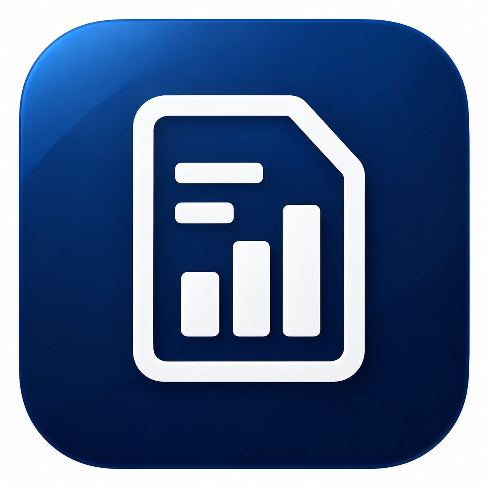

  

__LedgerLens__

LedgerLens is a native iOS financial intelligence application built with Swift and SwiftUI.

It helps users scan or upload bills, bank statements, and credit-card statements, extract structured financial data, ask natural-language questions, detect recurring payments, identify noteworthy charges, track bill due dates, and generate professional reports.

__Features__

- Document scanning with VisionKit
- PDF, JPEG, and PNG uploads
- Financial data extraction with Veryfi
- Natural-language document Q&A
- RAG with OpenAI embeddings
- Deterministic financial calculations in Swift
- Cross-document spending analysis
- Recurring payment detection
- Bill due-date reminders
- Financial attention dashboard
- Document folders and favorites
- PDF and CSV exports
- Face ID / Touch ID app lock
- Supabase authentication
- PostgreSQL with Row Level Security
- Private document storage
- Supabase Edge Functions

__Tech Stack__

- Swift
- SwiftUI
- UIKit
- VisionKit
- PDFKit
- Supabase
- PostgreSQL
- TypeScript / Deno
- OpenAI API
- Veryfi API
- REST APIs

__Architecture__

LedgerLens separates financial calculations from AI-generated explanations.

Swift calculates financial facts; AI retrieves and explains them.

Financial totals, filtering, transaction classification, recurring-payment detection, and cross-document comparisons are calculated deterministically in Swift.

OpenAI is used for semantic retrieval and natural-language explanation.

__Security__

- Supabase Auth
- JWT-based API authentication
- PostgreSQL Row Level Security
- Private Supabase Storage
- Server-side API secrets
- Edge Functions for Veryfi and OpenAI requests
- Face ID / Touch ID application lock

External API secrets are not stored inside the iOS application.
