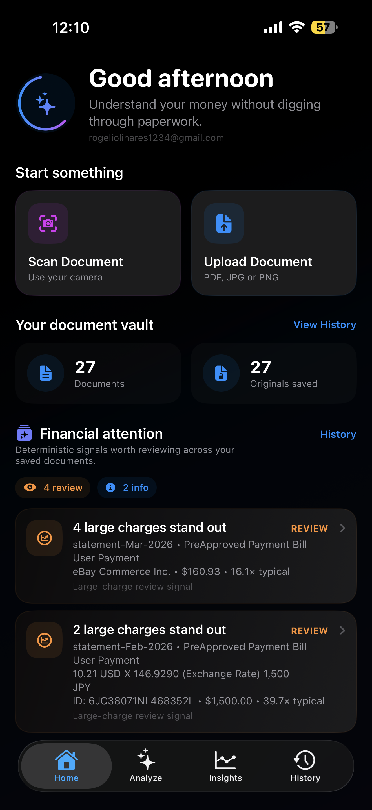
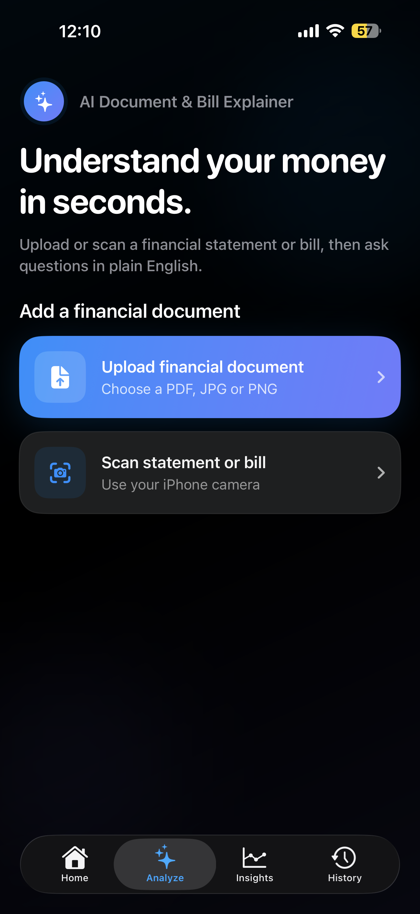
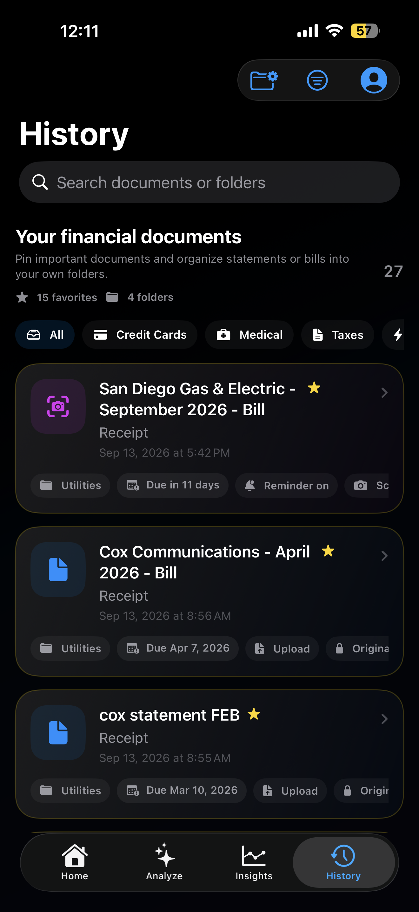

<p align="center">
  
</p>

# LedgerLens

### Native iOS Financial Document Intelligence

LedgerLens is a native iOS application that turns bills, bank statements, credit-card statements, receipts, and other financial documents into structured, searchable financial intelligence.

Users can scan or upload a document, extract financial data, ask natural-language questions, compare spending across documents, detect recurring payments, track due dates, identify noteworthy charges, and export professional reports.

> **Core engineering principle:** Swift calculates financial facts. AI retrieves and explains them.


## App Screenshots

<table>
  <tr>
    <td align="center">
      <strong>Home</strong><br><br>
      
    </td>
    <td align="center">
      <strong>Analyze</strong><br><br>
      
    </td>
  </tr>
  <tr>
    <td align="center">
      <strong>Financial Insights</strong><br><br>
      
    </td>
    <td align="center">
      <strong>Document History</strong><br><br>
      
    </td>
  </tr>
</table>


---

## Overview

Financial documents contain useful information, but they are often difficult to search, compare, and understand.

LedgerLens transforms those documents into a structured financial workspace.

```text
Scan / Upload Document
        ↓
Financial Extraction
        ↓
Swift Normalization
        ↓
Structured Financial Model
        ↓
┌───────────────────────────────┐
│ Deterministic Analytics       │
│ Semantic Search + RAG         │
│ Cross-Document Intelligence   │
│ Bill Reminders                │
│ Financial Attention Feed      │
└───────────────────────────────┘
        ↓
Insights • Q&A • Reports
```

---

## Key Features

### Document Intelligence

- Scan physical financial documents with VisionKit
- Upload PDF, JPEG, and PNG files
- Convert multi-page scans into a single PDF
- Extract structured financial data with Veryfi
- Automatically identify institutions and merchants
- Generate smarter document names
- Detect important financial dates
- Highlight large or unusual charges
- Identify possible repeated charges
- Analyze bank balance movement

### Financial Analysis

- Deterministic spending calculations in Swift
- Credit-card payment exclusion to prevent double-counting
- Pending vs. posted transaction awareness
- Transaction flow classification
- Cross-document spending comparisons
- Recurring-payment detection
- Multi-currency-safe analysis
- Statement, service-period, and billing-period resolution

### AI-Powered Q&A

LedgerLens supports multiple query strategies depending on the question.

```text
User Question
     ↓
Query Router
     ↓
┌────────────────────────────┐
│ Semantic Retrieval         │
│ Exhaustive Retrieval       │
│ Structured Filtering       │
│ Deterministic Aggregation  │
└────────────────────────────┘
     ↓
Relevant Financial Context
     ↓
OpenAI Explanation
```

Questions involving calculations are resolved deterministically rather than asking the language model to perform financial arithmetic.

For semantic questions, LedgerLens uses a Retrieval-Augmented Generation pipeline with embeddings and relevant document chunks.

---

## Financial Attention Feed

The Home dashboard surfaces information that may deserve the user's attention.

Examples include:

- Bills approaching their due dates
- Possible repeated charges
- Large-charge signals
- Significant bank balance changes
- Recently analyzed documents

The feed prioritizes financial events without labeling transactions as fraudulent or unauthorized.

---

## Cross-Document Intelligence

LedgerLens can analyze multiple saved financial documents together without re-uploading them to the extraction service.

```text
Saved Documents
      ↓
Local Restoration
      ↓
Financial Normalization
      ↓
Authoritative Period Resolution
      ↓
Clean Financial Records
      ↓
Cross-Document Analysis
```

This enables:

- Spending comparisons
- Period-over-period analysis
- Recurring-payment detection
- Financial trend summaries
- Multi-document Q&A

---
## Architecture

```text

┌──────────────────────────────────────────────────────────────────────┐
│                         iOS Application                              │
│                    Swift + SwiftUI + UIKit                           │
│                                                                      │
│   Home   |   Analyze   |   History   |   Reports   |   Account       │
│      \         |            |             |            /             │
│       \        |            |             |           /              │
│        └───────┴────────────┴─────────────┴──────────┘               │
│                               │                                      │
│                     Domain / Logic Layer                             │
│                               │                                      │
│   FinancialDocument  •  TransactionRecord  •  Query Router           │
│   CrossDocumentEngine • Recurring Detection                          │
│   Document Intelligence • Attention Feed                             │
│                               │                                      │
│              ┌────────────────┴────────────────┐                     │
│              │                                 │                     │
│      Apple Frameworks                   Supabase Client              │
│              │                                 │                     │
│   VisionKit • PDFKit                    HTTPS + JWT                  │
│   LocalAuthentication                          │                     │
│   UserNotifications                            │                     │
└────────────────────────────────────────────────┼─────────────────────┘
                                                 │
                                                 ▼
                              ┌──────────────────────────────┐
                              │          Supabase            │
                              │                              │
                              │  Auth                        │
                              │  PostgreSQL                  │
                              │  Row Level Security          │
                              │  Private Storage             │
                              │  Edge Functions              │
                              │  Rate Limiting               │
                              └──────────────┬───────────────┘
                                             │
                                ┌────────────┴────────────┐
                                │                         │
                                ▼                         ▼
                             Veryfi                    OpenAI

```
---

## Three-Layer Intelligence Model

LedgerLens separates extraction, financial reasoning, and language generation into independent layers.

### 1. Financial Extraction

Veryfi converts unstructured documents into structured financial data.

```text
PDF / Image
    ↓
Veryfi
    ↓
Structured JSON
```

### 2. Deterministic Financial Intelligence

Swift converts extracted data into LedgerLens' internal financial model.

This layer handles:

- Financial calculations
- Transaction classification
- Spending totals
- Date filtering
- Payment exclusion
- Recurring-payment detection
- Cross-document comparisons
- Bill due dates
- Repeated-charge detection
- Large-charge signals

### 3. Language Intelligence

OpenAI is used for semantic retrieval and natural-language explanations.

The language model is not treated as the source of truth for financial arithmetic.

---

## Example

A user asks:

> **"How much did I spend during this statement period?"**

LedgerLens does not simply send the entire statement to an LLM.

Instead:

```text
Question
   ↓
Query Classification
   ↓
Structured Transaction Filtering
   ↓
Exclude Payments / Credits / Refunds
   ↓
Decimal Arithmetic in Swift
   ↓
Verified Spending Total
   ↓
Optional Natural-Language Explanation
```

This architecture reduces hallucination risk for financial calculations.

---

## Reports & Exporting

LedgerLens can generate professional financial reports directly on-device.

Supported formats:

- PDF
- CSV

Reports can include:

- Document metadata
- Financial summary
- Verified totals
- Spending basis
- Transaction records
- Selected Q&A
- Analysis notes

Reports can be shared using the native iOS share sheet.

---

## Bill Reminders

LedgerLens extracts due dates from saved financial documents and allows users to schedule local reminders.

Available reminder options include:

- Due date
- 1 day before
- 3 days before
- 7 days before

Notifications are scheduled locally using Apple's `UserNotifications` framework.

---

## Document Organization

Users can organize financial documents with:

- Folders
- Favorites
- Search
- Filtering
- Sorting
- Smart document naming

Deleting a folder does not delete the financial documents contained within it.

---

## Authentication & Security

LedgerLens uses Supabase for authentication and backend security.

```text
iOS Application
      ↓
Public Supabase Configuration
      ↓
Supabase Auth
      ↓
User JWT
      ↓
PostgreSQL RLS / Private Storage / Edge Functions
      ↓
Server-Side API Secrets
      ↓
Veryfi + OpenAI
```

Security features include:

- Email/password authentication
- Email verification
- Password reset
- Secure email changes
- Face ID / Touch ID application lock
- JWT-authenticated backend requests
- PostgreSQL Row Level Security
- Private document storage
- Server-side third-party API secrets
- Edge Function rate limiting

Sensitive external API credentials are not stored inside the iOS application.

---

## Tech Stack

| Layer | Technology |
|---|---|
| iOS | Swift, SwiftUI |
| Apple Frameworks | UIKit, VisionKit, PDFKit, UserNotifications, LocalAuthentication |
| Backend | Supabase |
| Database | PostgreSQL |
| Security | Row Level Security, JWT |
| Serverless | Supabase Edge Functions |
| Edge Runtime | TypeScript / Deno |
| AI | OpenAI API |
| Retrieval | Embeddings + RAG |
| Financial Extraction | Veryfi API |
| Storage | Supabase Storage |
| API Communication | REST / HTTPS |

---

## Project Structure

```text
LedgerLens
├── Authentication
│   ├── AppSessionController
│   ├── SupabaseAuthManager
│   ├── LoginView
│   ├── SignUpView
│   └── BiometricLockManager
│
├── Document Processing
│   ├── DocumentScannerView
│   ├── VeryfiService
│   ├── DocumentAI
│   └── DocumentWorkspace
│
├── Financial Intelligence
│   ├── CrossDocumentAnalysis
│   ├── DocumentIntelligenceService
│   ├── HomeFinancialAttentionService
│   └── RecurringPaymentsView
│
├── Persistence
│   ├── DocumentHistoryService
│   ├── DocumentContinuityService
│   ├── ConversationService
│   └── DocumentFolderService
│
├── Reports
│   ├── DocumentReportExporter
│   ├── ReportExportSheet
│   └── ReportShareSheet
│
└── Backend
    └── Supabase Edge Functions
```

---

## Getting Started

### Requirements

- macOS
- Xcode
- iOS Simulator or physical iPhone
- Supabase project
- Veryfi account
- OpenAI API access

### Clone the Repository

```bash
git clone https://github.com/Codydeath78/LedgerLens-iOS.git
cd LedgerLens-iOS
```

### Local Configuration

The application's local configuration file is intentionally excluded from Git.

Create:

```text
LedgerLens/Config.xcconfig
```

Configure the required public Supabase values locally.

Do not commit secrets or private API credentials.

Third-party service secrets should remain inside secure server-side Supabase Edge Function configuration.

### Open the Project

```bash
open LedgerLens.xcodeproj
```

Build and run using Xcode.

---

## Engineering Decisions

### Why not let the LLM calculate financial totals?

Financial arithmetic requires predictable and reproducible results.

LedgerLens therefore performs calculations using Swift and `Decimal`, while the language model focuses on retrieval and explanation.

### Why use Edge Functions?

Veryfi and OpenAI credentials must not be shipped inside the iOS binary.

Supabase Edge Functions provide a server-side security boundary between the mobile client and external services.

### Why restore saved documents instead of reprocessing them?

Previously processed financial documents can be reconstructed from saved structured data.

This reduces:

- External API usage
- Latency
- Cost
- Duplicate processing

---

## Current Capabilities

LedgerLens currently includes:

- Financial document scanning
- File upload
- Structured financial extraction
- Persistent document history
- Natural-language Q&A
- RAG-based semantic retrieval
- Deterministic financial calculations
- Cross-document analysis
- Recurring-payment detection
- Bill reminders
- Financial attention feed
- Better Document Intelligence
- Folders and favorites
- Search and filtering
- PDF and CSV reporting
- Native sharing
- Face ID / Touch ID
- Secure authentication
- Private cloud document storage

---

## Disclaimer

LedgerLens is a software engineering project designed to help users organize and understand financial documents.

It does not provide financial, legal, tax, or investment advice.
